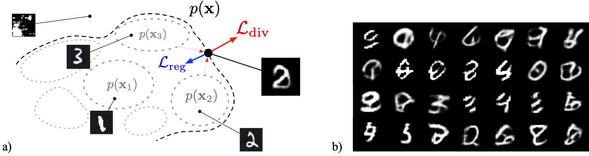

# divergent-synthesis



This repository contains the code for the *Creative divergent synthesis with generative models* paper, proposed @NeurIPS 2022 Workshop [Machine Learning for Creativity and Design](https://neuripscreativityworkshop.github.io/2022/). Every model used in this paper are available [here](https://nubo.ircam.fr/index.php/s/LGpgA7tzfkyM997), and full generations / scores can be found [here](https://nubo.ircam.fr/index.php/s/zABcRj3sifXwTYr).

## How to run

### Installation

```sh
$ git clone https://github.com/domkirke/divergent-synthesis.git
$ cd divergent-synthesis
$ pip install -r requirements.txt
```
If you want to train divergent models using the VAE / classifier, download them using the link above, and place the folders `vae_mnist` and `mnist_classifier` in the `runs` subfolder.

### Training a model
This repository uses the `hydra` package to manage configuration file. Once the training started, you can monitor using tensorboard within the results folder.
```sh
$ ls configs/*.yaml
configs/classifier_mnist.yaml
configs/div_alexnet_isfid.yaml
configs/div_alexnet_mmd.yaml
configs/div_custom_isfid.yaml
configs/div_custom_mmd.yaml
configs/div_inception_isfid.yaml
configs/div_inception_mmd.yaml
configs/div_mobilenet_isfid.yaml
configs/div_mobilenet_mmd.yaml
configs/vae_mnist.yaml
$ python3 train_model.py --config_name configs/div_custom_isfid.yaml rundir=/path/to/results
```

### Evaluating a model
The `evaluate-model.py` script can provide several measures and generations from a given model.

```
usage: evaluate_model.py [-h] [-l [{pr,ld,mse,kld,classif} [{pr,ld,mse,kld,classif} ...]]] [-g GENERATE] [-o OUTPUT] [--classif_model CLASSIF_MODEL] [--batch_size BATCH_SIZE] [--batches_max BATCHES_MAX]
                         [--temperatures TEMPERATURES]
                         model

positional arguments:
  model                 path to model

optional arguments:
  -h, --help            show this help message and exit
  -l [{pr,ld,mse,kld,classif} [{pr,ld,mse,kld,classif} ...]], --losses [{pr,ld,mse,kld,classif} [{pr,ld,mse,kld,classif} ...]]
                        losses to compute
  -g GENERATE, --generate GENERATE
                        number of generated examples (default: 0)
  -o OUTPUT, --output OUTPUT
                        outputs directory
  --classif_model CLASSIF_MODEL
                        id for generative losses embeddings
  --batch_size BATCH_SIZE
                        batch size (default: 256)
  --batches_max BATCHES_MAX
                        maximum number of batches (default: none)
  --temperatures TEMPERATURES
                        temperatures used for latent sampling (only impacts generations)
```
